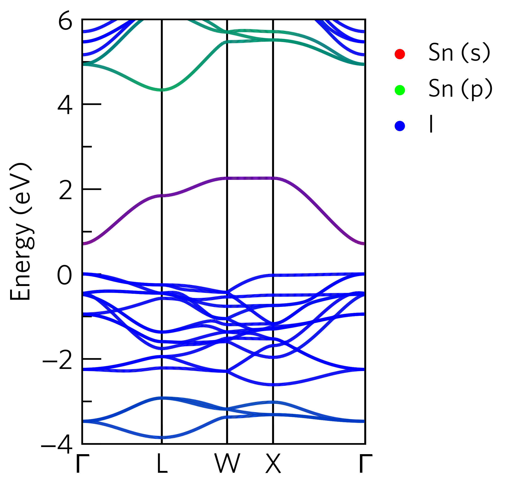
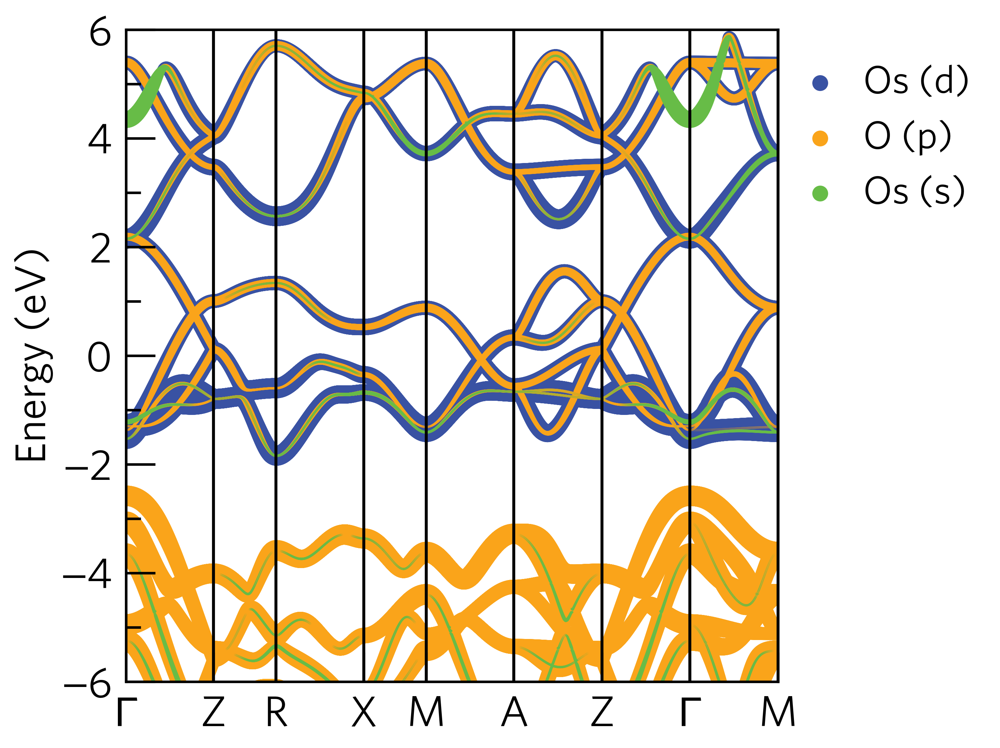
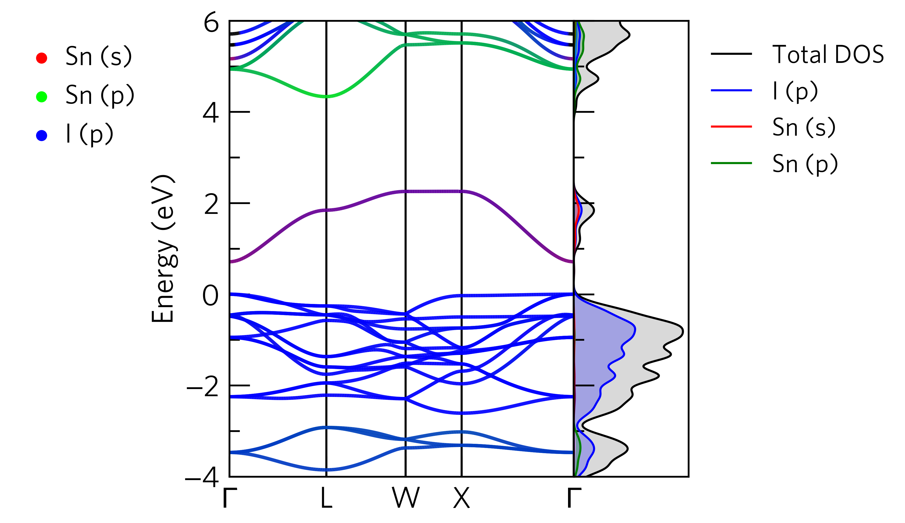

sumo-bandplot
==============

``sumo-bandplot`` is a program for generating publication-ready band structure diagrams.
A large number of features are provided, including the ability to project orbital
contributions on to the band structure.

.. contents:: Table of Contents
   :local:
   :backlinks: None

Usage
-----

The full range of options supported by ``sumo-bandplot`` are detailed in the `Command-Line Interface`_ section,
and be can be accessed using the command::

    sumo-bandplot -h

To plot a band structure, simply run the following command in a folder containing a ``vasprun.xml`` or
``vasprun.xml.gz`` file, which has been calculated along a high-symmetry path::

    sumo-bandplot

The plot will be written to a file named ``band.pdf``, with the raw band structure data written to ``band.dat``.

For example, if we run the command in the ``sumo/tests/data/Cs2SnI6/bandstructure`` directory, the band structure
should look like:

.. image:: figures/band_basic.png
   :height: 400px
   :align: center

File Searching
~~~~~~~~~~~~~~

``sumo-bandplot`` will automatically look for ``vasprun.xml`` or ``vasprun.xml.gz`` files in the current
directory. If the band structure has been broken up into multiple parts (as is common
for hybrid band structure calculations), these files will be preferentially used. For this to work, the
folders should be named ``split-0*`` and ``sumo-bandplot`` should be run in the folder containing
the splits. For example, if the file structure is as follows:

.. code-block:: bash

    bandstructure/
        split-01/
            KPOINTS
            vasprun.xml
        split-02/
            KPOINTS
            vasprun.xml

``sumo-bandplot`` should be run in the ``bandstructure`` directory.

Basic Options
~~~~~~~~~~~~~

To specify a particular ``vasprun.xml`` to plot, the ``--filenames`` option can be used.
If multiple ``vasprun.xml`` files are provided, they will be combined into a single band
structure.

The valence band maximum and conduction band minimum can be highlighted using the ``--band-edges`` option.

The height, and width of the graphic, along with the y-axis limits, can be controlled via the
``--width``, ``--height``, ``--ymax``, and ``--ymin`` options. For example, the plot above could be
made more appealing using the following command::

    sumo-bandplot --width 4 --ymin -4 --band-edges

.. image:: figures/band_rectangle.png
   :height: 400px
   :align: center

Combined Band Structure and Density of States Plots
~~~~~~~~~~~~~~~~~~~~~~~~~~~~~~~~~~~~~~~~~~~~~~~~~~~

``sumo-bandplot`` can be used to simultaneously plot a band structure and density of states,
using the ``--dos`` option. A ``vasprun.xml`` to use for the density of states information
is required as input. For example, if we run the following command in the
``sumo/tests/data/Cs2SnI6/bandstructure`` folder, the output will look like::

    sumo-bandplot --dos ../dos/vasprun.xml.gz --ymin -4

.. image:: figures/band_with_dos.png
   :height: 400px
   :align: center

Many options are provided for controlling the density of states output. The usage of these
options is the same as in ``sumo-dosplot`` and described in more detail on
the :ref:`sumo-dosplot` page.

To control the number of items that appear in the legend, see :ref:`Legend Labels`.

For plotting specific orbital or atomic contributions, see
:ref:`Selective Plotting of Specific Orbitals and Atoms`.

Furthermore, the colours of the lines in the density of states can be controlled
by a configuration file (``--config``). See :ref:`Custom Line Colours` for more details.

Projected Band Structures
~~~~~~~~~~~~~~~~~~~~~~~~~

``sumo-bandplot`` can produce projected band structures, where the orbital contributions
to a band are plotted. This behaviour is accessed using the ``--project`` option.
The syntax for specifying which orbitals to project is as follows:

- Elements are identified using their symbol from the ``POSCAR``
- Multiple elements are separated via commas.
- Specific orbitals can be chosen by adding the orbital after the element using a period as a separator.
- If multiple orbitals are included for a single element definition, these will be combined into a single
  contribution.
- If no orbitals are specified but the atomic symbol is included, then all orbitals of that element will
  be combined.
- Multiple definitions for the same element are allowed (e.g. each specifying different orbitals).

For example, to project the Sn s orbitals, the Sn p orbitals and a combined contribution from all the I orbitals,
the command would be::

    sumo-bandplot --project Sn.s,Sn.p,I

For projected plots, the band structure and the projections are interpolated to ensure the bands are
smooth. The degree of interpolation can be controlled by the ``--interpolate-factor`` option.
The default is ``4``, meaning the density of the eigenvalues and projections is quadrupled.

Multiple projection modes are supported. These are controlled by the ``--mode`` option.

**RGB Mode**

The default is ``--mode rgb``. Here the line colour depends on the character of the band. Each
element or orbital contributes either red, green or blue, with the corresponding line colour
a mixture of all three colours. **This mode only supports up to 3 element/orbitals combinations.**
The order of the elements/orbitals determines which colour is used for each selection.

For example, if the following command is run in the ``sumo/tests/data/Cs2SnI6/bandstructure`` directory,
the output should look like::

    sumo-bandplot --project Sn.s,Sn.p,I --ymin -4 --width 4

**RGB Mode (custom colours)**

Custom colours can be specified in RGB mode using the ``--colour1``, ``--colour2``, and
``colour3`` options. Furthermore, by default, colour interpolation is performed in LAB
colourspace for more natural transitions between colours. An alternative colourspace
can be specified using the ``--colourspace`` option.

For example, if the following command is run in the ``sumo/tests/data/Cs2SnI6/bandstructure`` directory,
the output should look like::

    sumo-bandplot --project Sn.s,Sn.p,I --ymin -4 --width 4 --colour1 "#CC33A7" --colour2 "#A7CC33" --colour3 "#33A7CC"

.. image:: figures/band_projected_rgb_colours.png
   :height: 400px
   :align: center

**Stacked Mode**

If using ``--mode stacked``, the element or orbital contributions are drawn as a series of stacked
circles. The size of the circles can be scaled using the ``--circle-size`` option. This mode supports
an unlimited number of element/orbital contributions.

For example, if the following command is run in the ``sumo/tests/data/OsO2/bandstructure`` directory,
the output should look like::

    sumo-bandplot --project Os.d,O.p,Os.s --mode stacked --circle-size 90

Advanced Example
~~~~~~~~~~~~~~~~

It is possible to combine both the ``--density`` and ``--project`` keywords. For best results,
it is advised to use a configuration file (see :ref:`Custom Line Colours`) to ensure the colours
are consistent.

For example, using the following configuration file (stored in this
example as ``my_colours.conf``)::

    [I]
    p = b

    [Sn]
    s = r
    p = g

The following command, run in the ``sumo/tests/docs/Cs2SnI6/bandstructure`` folder, should output the graphic below::

    sumo-bandplot  --dos ../dos/vasprun.xml.gz \
                    --project Sn.s,Sn.p,I.p \
                    --config my_colours.conf \
                    --ymin -4

Questaal
~~~~~~~~

Basic band structure plotting is supported for LMTO calculations with
Questaal using ``lmf``. (Orbital projection is not currently included.)

A structure file (*site.ext*), symmetry lines file (*syml.ext*) and
band structure output file (*bnds.ext*) should be present in the same
directory with the same *ext* identifier. You can then plot with Sumo::

    sumo-bandplot --code questaal -f bnds.ext

The usual appearance options are supported.

Command-Line Interface
----------------------

.. argparse::
   :module: sumo.cli.bandplot
   :func: _get_parser
   :prog: sumo-bandplot
