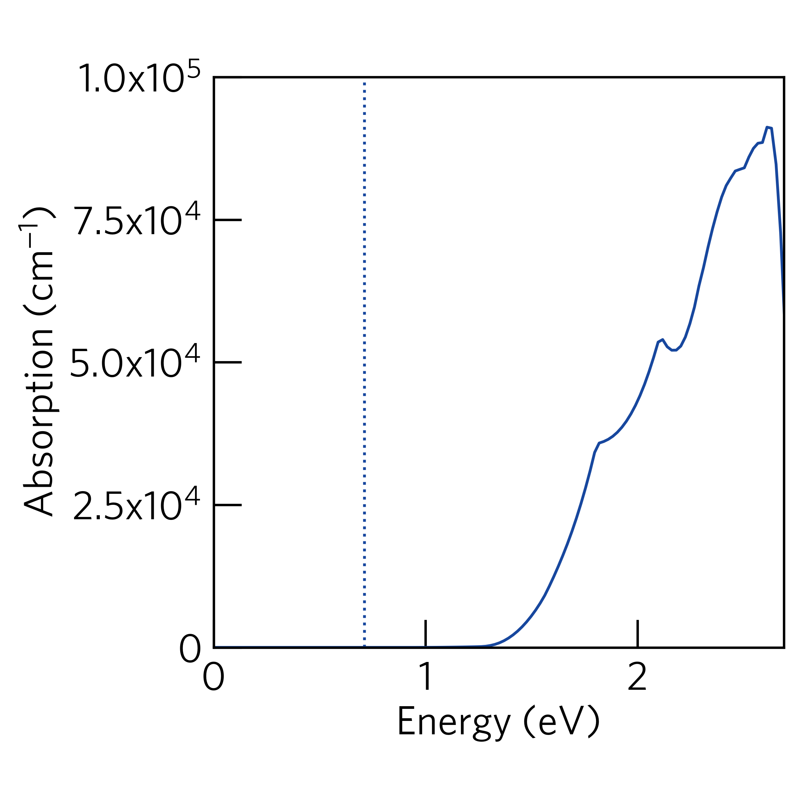
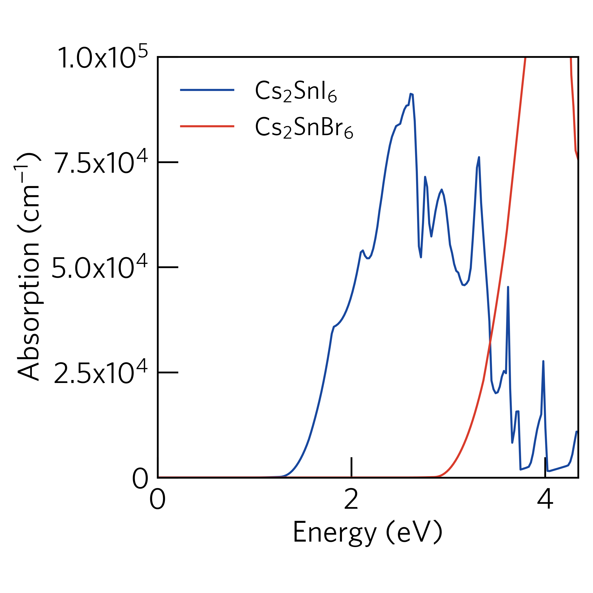

sumo-optplot
==============

``sumo-optplot`` is a program for generating publication-ready optical absorption
spectra diagrams from VASP calculations. The script supports plotting multiple
spectra simultaneously.

.. contents:: Table of Contents
   :local:
   :backlinks: None

Usage
-----

The full range of options supported by ``sumo-optplot`` are detailed in the `Command-Line Interface`_ section,
and be can be accessed using the command::

    sumo-optplot -h

To plot an absorption spectra, simply run the following command in a folder containing a ``vasprun.xml`` or
``vasprun.xml.gz`` file, which has been calculated using ``LOPTICS = .TRUE.``::

    sumo-optplot

The plot will be written to a file named ``absorption.pdf``, with the raw data written to ``absorption.dat``.

For example, if we run the command in the ``sumo/tests/data/Cs2SnI6/optics`` directory, the absorption
spectra should look like:

.. image:: figures/absorption_basic.png
   :height: 400px
   :align: center

Basic Options
~~~~~~~~~~~~~

``sumo-optplot`` automatically searches for a ``vasprun.xml`` file in the current directory.
To specify a particular ``vasprun.xml`` to plot, the ``--filenames`` option can be used.

The height, and width of the graphic, along with the y-axis limits, can be controlled via the
``--width``, ``--height``, ``--ymax``, and ``--ymin`` options.

Additional gaussian broadening can be applied using the ``--gaussian`` option. The setting expects a floating
point number as the argument and controls the standard deviation of the broadening applied.

Anisotropic Absorption
~~~~~~~~~~~~~~~~~~~~~~

By default, ``sumo-optplot`` plots the average optical absorption. The anisotropic contributions
from the x, y and z cartesian directions can be plotted individually using the ``--anisotropic``
option.

For example, if we run the following command in the ``sumo/tests/data/Cs2SnI6/optics`` directory,
the anisotropic absorption spectra should look like::

    sumo-optplot --anisotropic

.. image:: figures/absorption_anisotropic.png
   :height: 400px
   :align: center

Displaying Band Gaps
~~~~~~~~~~~~~~~~~~~~

The band gap of the system can be indicated using the ``--bandgap`` option.
There are several ways to use this option:

- If the option is given with no arguments, then the band gap will be
  extracted from the ``vasprun.xml`` file.
- A path to a separate ``vasprun.xml`` file can be supplied,
  in which case the band gap will be read from this calculation.
- A number can be supplied.

For example, if we run the following command in the ``sumo/tests/data/Cs2SnI6/optics`` directory,
the plot should look like::

    sumo-optplot --bandgap ../bandstructure/split-01/vasprun.xml.gz

Plotting Multiple Spectra
~~~~~~~~~~~~~~~~~~~~~~~~~

Multiple absorption spectra can be plotted simultaneously by specifying multiple
``vasprun.xml`` files using the ``--filenames`` option.
A label will be generated for each system, based on the composition. Alternatively,
the ``--labels`` option can be used to provide a name for each system. The number
of ``vasprun.xml`` files must be equivalent for the number of labels.

For example, if we run the following command in the ``sumo/tests/data/Cs2SnI6/optics`` directory,
the plot should look like::

    sumo-optplot --filenames vasprun.xml.gz ../../Cs2SnBr6/vasprun.xml.gz

This mode also supports plotting the band gap of each compound using the ``--bandgap`` option.

Questaal
~~~~~~~~

LMTO optics calculations with the ``lmf`` program are supported;
when ``OPTICS MODE=1`` (or greater) in the *ctrl.ext* file an
*opt.ext* file is written with the imaginary dielectric function vs
energy in Ry. Sumo can import this file and compute a real component
with the Kramers-Kronig relation; this provides the information
needed for plotting optical properties. To plot the optical absorption::

   sumo-optplot --code questaal -f opt.ext

The *opt_BSE.out* file from ``bethesalpeter`` calculations is also
supported; this format will be detected as long as "opt_BSE" is
somewhere in the filename.

Command-Line Interface
----------------------

.. argparse::
   :module: sumo.cli.optplot
   :func: _get_parser
   :prog: sumo-optplot
